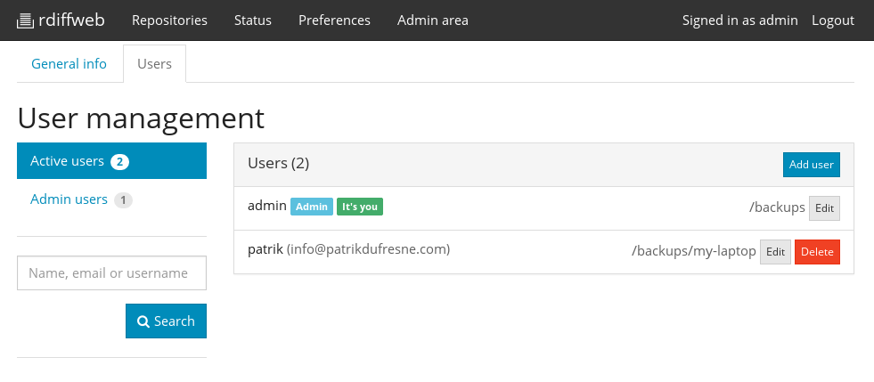

# Rdiffweb FAQ

## How to install rdiffweb?

Complete installation instructions are available in [documentations](https://github.com/ikus060/rdiffweb/blob/master/doc/index.md).

## How to update the temporary folder used to restore data?

By default rdiffweb is using the "/tmp" folder as a working directory to
restore your data. This might cause some issues if you are trying to restore a
huge folder and your /tmp is tiny. In this situation you might get a similar
error to :

    Unable to restore! rdiff-backup output: Exception '[Errno 28] No space left
    on device'

**Version 0.6.5 (and before)**  
To fix this situation, you may change your temporary folder by redefining TEMP
environment variable. You can do so by editing your init script.

**Since 0.7.0**  
To fix this issue you may edit your configuration file "/etc/rdiffweb/rdw.conf"
and change the "tempdir" configuration parameters. Make sure the new location
exist and is readable and writable.

reference: http://forum.tinycorelinux.net/index.php/topic,17765.0.html

## What is a "repository"?

A repository represent a directory where rdiff-backup has create a
structure to store your data. Basically, a repository is a directory
containing the `rdiff-backup-data` folder.

As an example, look at the following folder structure.

    + / (root)
      |
      + backups
        |
        + my-laptop
        | |
        | + rdiff-backup-data
        | |
        | + home
        |
        + server1
          |
          + rdiff-backup-data
          |
          + home
          |
          + etc
          |
          + var

It contains two (2) repositories: `/backups/my-laptop/` and `/backups/server1/`.

## How to configure the repositories?

Now you know what is a backup location, in the scope of rdiffweb, you need to
understand how to configure them to be shown in rdiffweb. Once your
installation of rdiffweb is completed, go to the admin area to configure
your users.

For each users, you must assign a "root directory". **The user can access every
repositories placed underneath the "root directory".** Consider the
following assignment:

 * admin: /backups/
 * patrik: /backups/my-laptop/

Assignment of a "root directory" is the only way to control access to
repositories.

 * The "admin" user will have access to "my-laptop" and "server1" repositories.
 * The user "patrik" only has access to "my-laptop" repository.

## How to change/fixe encoding?

On linux the filenames doesn't have any specific encoding. By default, if you're
creating files directly on the server, the application uses the default
encoding of your system (usually stored in variable environment LANG). In most
cases, the default encoding on Linux is UTF-8. This encoding is then used by
rdiffweb to interpret the filenames. This works 99% of the time unless your
files are created by an external system. I'm talking about Windows. If the
files you want to backup is created by Windows, it's problable the
filenames won't use UTF-8 encoding. This situation might arise if: 

 * you run rdiff-backup on Windows;
 * you are using Samba2 without proper configuration.

Since version 0.7, rdiffweb is supporting this scenario, but you might
end up with the wrong filename in the web interface. The following screenshots
represent the problem. You may continue to use
rdiffweb without any modifications. Browsing and restoring your data should not
be affected by this visual problem. 

To get the proper filename in the web interface, it's possible to provide a
hints to rdiffweb.

**1. You need to know what is the encoding**

If your data is generated by a Windows computer, you need to figure out which
encoding is used by your Windows system. We are still searching for the best
way to get this value without a third party application. If you are using
rdiffweb, the right encoding is probably in the following table. If not have a
look at this link: [complete code page table](http://msdn.microsoft.com/en-ca/library/windows/desktop/dd317756(v=vs.85).aspx)

* window-1250  : ANSI Central European; Central European (Windows)
* window-1251  : ANSI Cyrillic; Cyrillic (Windows)
* window-1252  : ANSI Latin 1; Western European (Windows)
* window-1253  : ANSI Greek; Greek (Windows)
* window-1254  : ANSI Turkish; Turkish (Windows)
* window-1255  : ANSI Hebrew; Hebrew (Windows)
* window-1256  : ANSI Arabic; Arabic (Windows) 
* window-1257  : ANSI Baltic; Baltic (Windows)
* window-1258  : ANSI/OEM Vietnamese; Vietnamese (Windows)

**2. Tell rdiffweb about the right encoding**

Once you have identify the encoding used for your filenames, you may tell
it to rdiffweb.

Inside the "rdiff-backu-data" directory, create a new file named "rdiffweb" 
with the following contents:

    encoding=windows-1252

The result should be immediate. In your web browser, refresh the page and the
new encoding should take effect.

## How to enable HTTPS / SSL

Multiple solutions are available to run rdiffweb with SSL. If you are really
serious about security. It is highly recommended to run rdiffweb behind an
Apache server as suggested in [documentation](https://github.com/ikus060/rdiffweb/blob/master/doc/index.md). Otherwise,
you may simply enable SSL as follow.

Add the following lines to your "/etc/rdiffweb.rdw.conf".

    SSLCertificate=/path/to/certificate.file
    SSLPrivateKey=/path/to/key.file