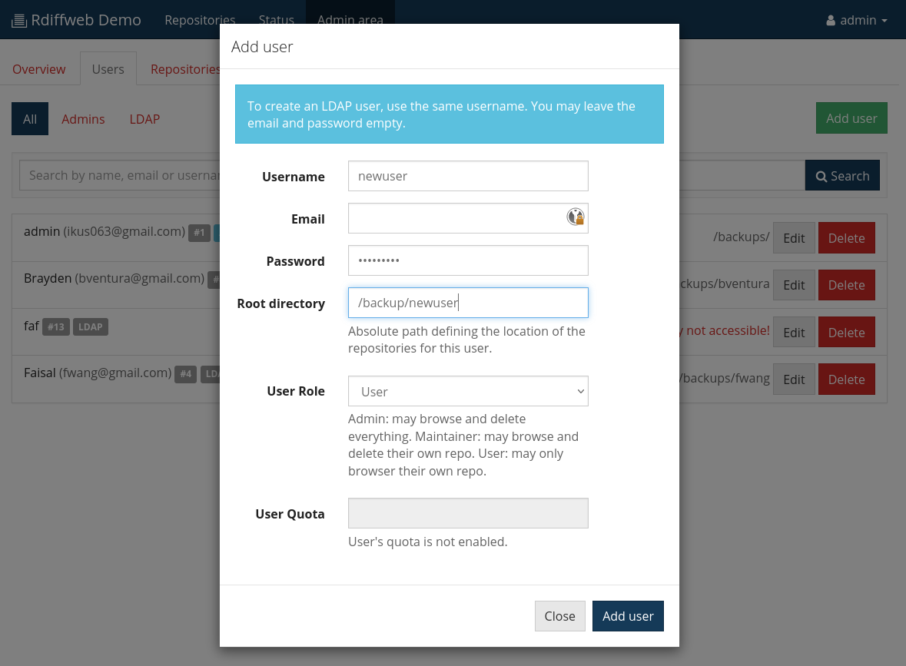

# Runtime Settings

This section describes the settings available from the web interface
and that are editable at runtime in opposition to configuration that
are defined at application startup.

## Users’ repositories

A repository represents a directory where rdiff-backup has created a
structure to store your data. Basically, a repository is a directory
containing the `rdiff-backup-data` folder.

As an example, look at the following folder structure.

    + / (root)
      |
      + backups
        |
        + my-laptop
        | |
        | + rdiff-backup-data
        | |
        | + home
        |
        + server1
          |
          + rdiff-backup-data
          |
          + home
          |
          + etc
          |
          + var

It contains two (2) repositories: `/backups/my-laptop/` and `/backups/server1/`.

Once your installation of rdiffweb is completed, go to the admin area to configure
your users root directory.

For each user, you must assign a "root directory". **The user can access every
repository placed underneath the "root directory".** Consider the
following assignment:

* admin: /backups/
* patrik: /backups/my-laptop/

Assignment of a "root directory" is the only way to control access to
repositories.

* The "admin" user will have access to "my-laptop" and "server1" repositories.
* The user "patrik" only has access to "my-laptop" repository.

## Users' roles & permissions

In the administration view, you may create a new user to give him access to Rdiffweb
user interface. That would allow him to connect to Rdiffweb with a username and a
password that you define. In addition, you must also assign a user’s role to this
newly created user.

The following table lists permissions available for each role:

| Action | User | Maintainer | Admin
| ------ |:----:|:---:|:---:|
| Browse one of his repositories                               | ✓ | ✓ | ✓ |
| View Graphs, logs and status of his repositories            | ✓ | ✓ | ✓ |
| Retrieve a file or a directory from one of his repositories  | ✓ | ✓ | ✓ |
| Modify the encoding of one of his repositories               | ✓ | ✓ | ✓ |
| Modify the encoding of one of his repositories               | ✓ | ✓ | ✓ |
| Modify the notification parameters (email and delay)         | ✓ | ✓ | ✓ |
| Change his password                                          | ✓ | ✓ | ✓ |
| Adding new SSH Key                                           | ✓ | ✓ | ✓ |
| Deleting an SSH Key                                          |   | ✓ | ✓ |
| Delete one of his repositories                               |   | ✓ | ✓ |
| Delete the history of a file or folder from his repositories |   | ✓ | ✓ |
| Modify the retention period of one of his repositories       |   | ✓ | ✓ |
| View system logs                                             |   |   | ✓ |
| View system informations (ram, cpu, version, dependencies)   |   |   | ✓ |
| Create new users                                             |   |   | ✓ |
| Modify other user's email, password and role                 |   |   | ✓ |
| Define other user's quota                                    |   |   | ✓ |
| Delete other user's repository                               |   |   | ✓ |
| Delete the history of a file or folder from other users      |   |   | ✓ |
| Browse other user's repository                               |   |   | ✓ |
